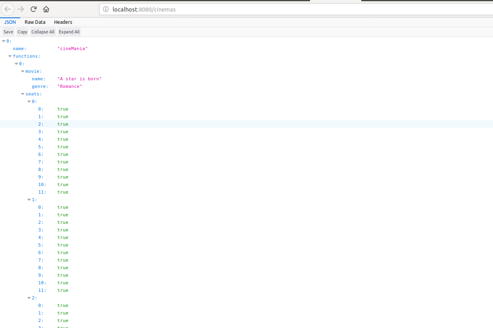
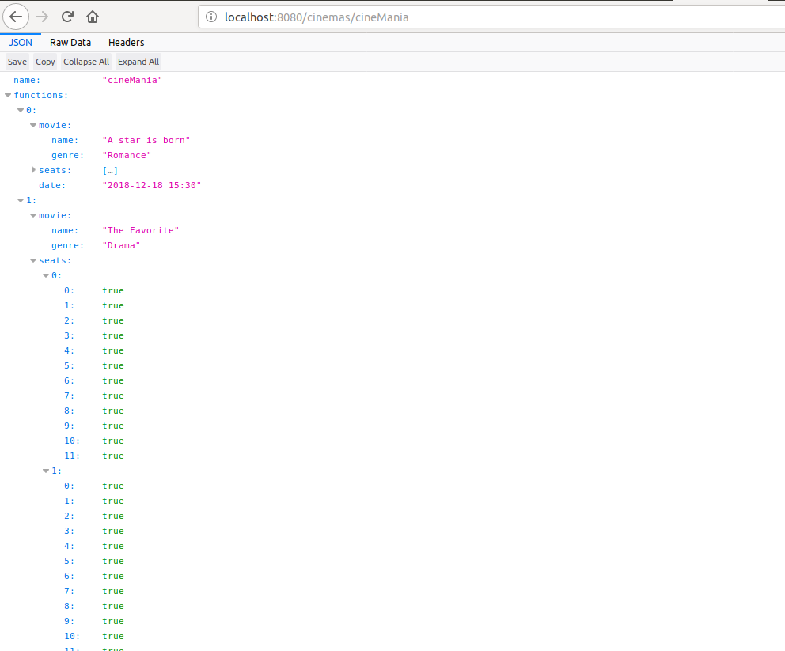
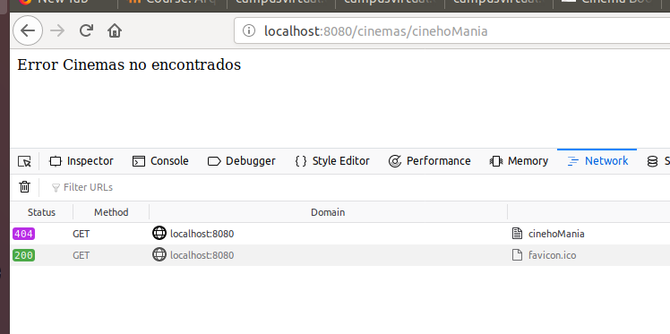
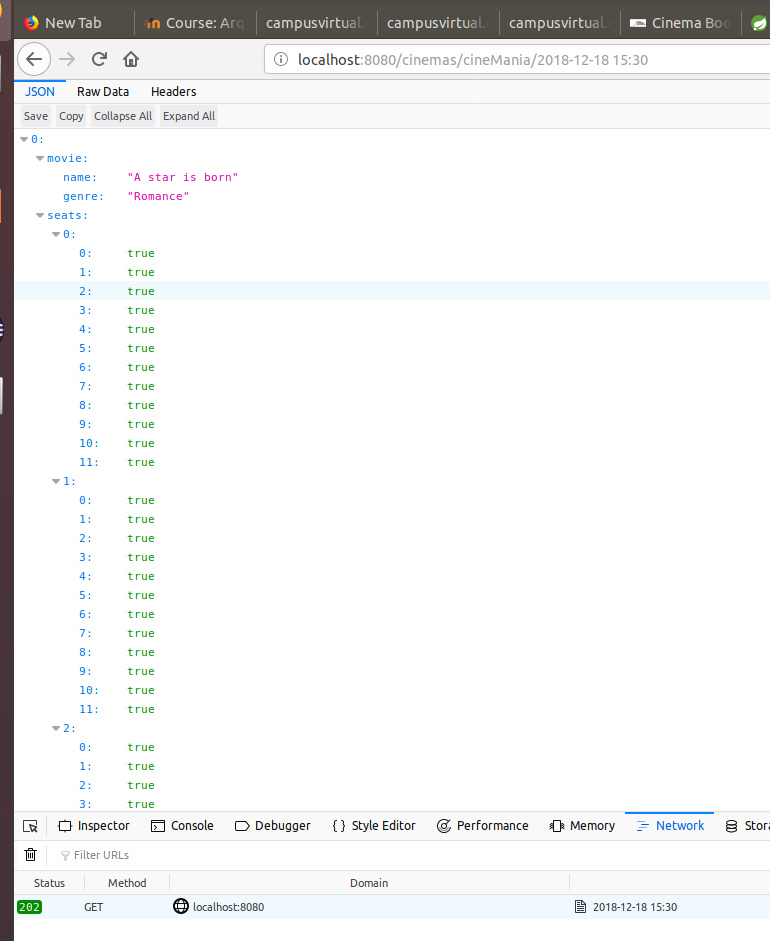

# ARSWLab6-Cinema Book System II

## Parte I

1.  Integre al proyecto base suministrado los Beans desarrollados en el [Ejercicio Anterior](https://github.com/ARSW-ECI-beta/REST_API-SpringBoot-Cinema_Base). Sólo copie las clases, NO los archivos de configuración. Rectifique que se tenga correctamente configurado el esquema de inyección de dependencias con las anotaciones @Service y @Autowired.
    
2.  Modifique el bean de persistecia 'InMemoryCinemaPersistence' para que por defecto se inicialice con al menos otras 2 salas de cine, y al menos 2 funciones asociadas a cada una.
    
3.  Configure su aplicación para que ofrezca el recurso "/cinema", de manera que cuando se le haga una petición GET, retorne -en formato jSON- el conjunto de todos los cines. Para esto:
    
    1.  Modifique la clase CinemaAPIController teniendo en cuenta el ejemplo de controlador REST hecho con SpringMVC/SpringBoot. **(ver code 1)**
        
    2.  Haga que en esta misma clase se inyecte el bean de tipo CinemaServices (al cual, a su vez, se le inyectarán sus dependencias de persistencia y de filtrado de películas).
        
    3.  De ser necesario modifique el método getAllCinemas(), de manera que utilice la persistencia previamente inyectada y retorne todos los cines registrados.
        
    
4.  Verifique el funcionamiento de a aplicación lanzando la aplicación con maven **(ver code 2).** Y luego enviando una petición GET a: [http://localhost:8080/cinemas](http://localhost:8080/cinemas). Rectifique que, como respuesta, se obtenga un objeto jSON con una lista que contenga el detalle de los cines suministados por defecto.

    
5.  Modifique el controlador para que ahora, acepte peticiones GET al recurso /cinemas/{name}, el cual retorne usando una representación jSON todas las funciones del cine cuyo nombre sea {name}. Si no existe dicho cine, se debe responder con el código de error HTTP 404. Para esto, revise en [la documentación de Spring](http://docs.spring.io/spring/docs/current/spring-framework-reference/html/mvc.html), sección 22.3.2, el uso de @PathVariable. De nuevo, verifique que al hacer una petición GET -por ejemplo- a recurso [http://localhost:8080/cinemas/cinemaY](http://localhost:8080/cinemas/cinemaY) , se obtenga en formato jSON el conjunto de funciones asociadas al cine 'cinemaY' (ajuste esto a los nombres de cine usados en el punto 2).

Cuando un cinema no existe (ejm: cinehoMania)

    
6.  Modifique el controlador para que ahora, acepte peticiones GET al recurso /cinemas/{name}/{date}, el cual retorne usando una representación jSON una lista de funciones asociadas al cine cuyo nombre es {name} y cuya fecha sea {date}, para mayor facilidad se seguirá manejando el formato "yyyy-MM-dd". De nuevo, si no existen dichas funciones, se debe responder con el código de error HTTP 404.

Se consulta el cine "cineMania" en la fecha 2018-12-18 15:30

8.  Modifique el controlador para que ahora, acepte peticiones GET al recurso /cinemas/{name}/{date}/{moviename}, el cual retorne usando una representación jSON sólo UNA función, en este caso es necesario detallar además de la fecha, la hora exacta de la función de la forma "yyyy-MM-dd HH:mm". Si no existe dicha función, se debe responder con el código de error HTTP 404.
